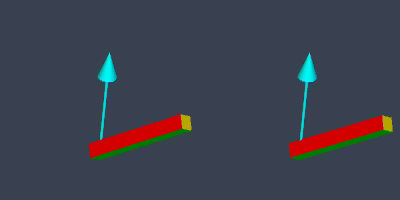
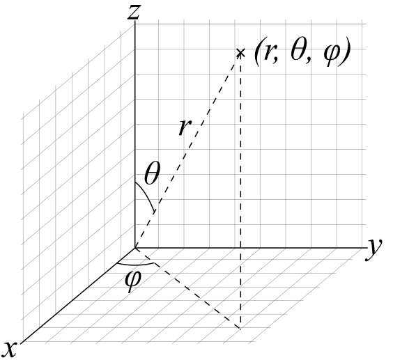

# FABRIKSolver ThreeJs - Constraint Types

All angles are expressed in radiants

All constraints are computed through a [twist-and-swing decomposition](https://allenchou.net/2018/05/game-math-swing-twist-interpolation-sterp/#:~:text=decomposition%20comes%20in.-,Swing%2DTwist%20Decomposition,-Swing%2DTwist%20decomposition)

Given a joint to be constrained in a chain, the twist axis will be the direction set from this joint to its immediate child (following the chain). Then, the twist rotation is applied on that axis.

The swing rotation, then moves the bone

Final Rotation = SwingRot * TwistRot;

*Swing on the left. Twist on the right*




## OMNI
Only has twist restrictions.

```
// restriction object to send to FABRIKSolver
{
    twist : [ minAngle, maxAngle ]  
}
```

## HINGE

Forces the bone to move on the plane generated by *axis*
The *axis* property pointing towards +z (0,0,1) corresponds to the direction of the **bone on bind pose**.

```
// restriction object to send to FABRIKSolver
{
    twist : [ minAngle, maxAngle ], 
    axis : THREE.Vector3,
    min : number,
    max : number
}
```


## BALL-SOCKET

Uses [spherical coordinates](https://en.wikipedia.org/wiki/Spherical_coordinate_system) to decompose the swing rotation.
Given an axis:
- The polar angles represent the aperture with respect to that axis. Range [ 0, PI ] (Angle with Z-axis)
- The azimuth angles represent the angle of the point projected into the plane generated by the axis (Angle in XY plane).

*Spherical coordinates visualisation*



The *axis* property of the restriction refers to the +z axis in the image above. 
When the *axis* property points towards +z (0,0,1), the +z in the image above will correspond to the direction of the **bone on bind pose**.

```
// restriction object to send to FABRIKSolver
{
    twist : [ minAngle, maxAngle ], 
    axis : THREE.Vector3, // or equivalent
    polar : [ minAngle, maxAngle ],
    azimuth : [ minAngle, maxAngle ]
}
```
